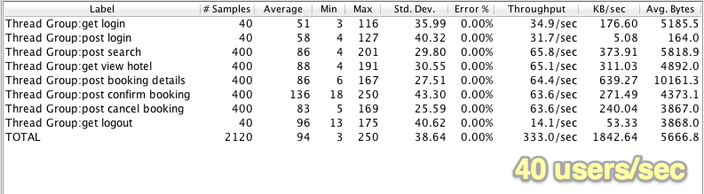

## Hotels Booking

A minimalistic *Hotel booking* demo app used for benchmarking the Micro framework. It is loosely modelled after the Wicket application used by Peter Thomas in his article: [Seam / JSF vs Wicket](http://ptrthomas.wordpress.com/2009/01/14/seam-jsf-vs-wicket-performance-comparison/). The app repo contains the simple stats grabbed during the benchmarking sessions.

### Available functionality:

  - Login/Logout and User registration
  - search hotels
  - full pagination support
  - view hotel details
  - booking a reservation
  - view hotel reservations
  - cancel reservations
  - using [Bootstrap Twitter](http://twitter.github.com/bootstrap/index.html) for styling

This is the main page of the web application:

### Additional stuff included
Apart the application itself the following extras are included:

  - the latest [Bootstrap Twitter](http://twitter.github.com/bootstrap/index.html) release
  - a pre-release binary of the [ActiveJDBC](https://code.google.com/p/activejdbc/)(AJ) µ Extensions using the [BoneCP](http://jolbox.com/) Java database connection pool (JDBC Pool) library.
  - the ANT scripts for compiling the AJ models and controllers
  - the JMeter script used for benchmarking the application.
  - various screen grabs containing the JMeter results, in case you don't wish to run them by yourself
  - a jetty.xml file that you can use to customize your µ applications i.e. logging, min/max threads, stderr output, SSL and more. Please make sure you're using the latest Micro distribution!
  
### Benchmarks results
The following results were obtained on an iMac 2.8GHz Intel Core I5, 8GB mem. The JVM runtime configuration is using the same setup I have for my free Heroku instance hosting the Micro [documentation web site](micro-docs.simplegames.ca). Attached for brevity:

    -Xmx128m -Xss512k -XX:+UseCompressedOops

Below are the screens captured at the end of each of the three benchmarking sessions.
    
## 10 Users

  
  
## 20 Users
  
  
  
## 40 Users

  

### To use it:

 - check if Micro is installed properly; see the [docs](http://micro-docs.simplegames.ca/), for more details.
 - quickly check if Micro was built and it can be used:
    `$ micro -v`; you should see something like this: `Micro 0.1.2` 
 - start this web application:
    `$ cd micro-aj` 
    `$ ./run.sh`

Optionally, if you want to modify the ActiveJDBC models or the µ controllers:
    
    $ cd WEB-INF
    $ ant
The steps above will compile all the classes and will instrument the ActiveJDBC models. The binaries are provided for your convenience. Sorry, Maven users :P

if the server is running, you can access this app at:

    `http://localhost:8080` or `http://0.0.0.0:8080`

### To stop the app

Simply press `CTRL-C` in the console where the application was started.

Feedback is highly appreciated, thank you.
