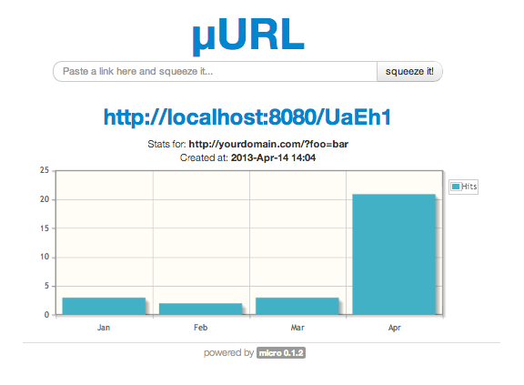

## µURL shortener

A really simple (µ)Micro web application that can be used for creating and publishing shorter URLs. The app is also calculating the monthly hit stats for a given URL, drawing a nice graph every time you re-use a link; functionality inspired by Google's own [url shortener](http://goo.gl/). While very simple, it is quite functional and very easy to use. It can be hosted easily and it can be used as a Intranet service or as your own public µURL shortener :) 

Worth noting that you can limit the functionality of the application to a handful of domain names, this way you will only accept and process links from known domains i.e. your own; see the details below.

## Build
This application is part of the [micro-examples](https://github.com/florinpatrascu/micro-examples) repository at Github. So, grab it and go to the `micro_url/WEB-INF` folder to build it:

    $ cd .... micro_url/WEB-INF
    $ ant

To start the app in server mode, go to the main app folder `micro_url` and use the script provided:    

    $ cd .... micro_url/
    $ ./run.sh

Point your browser to: `http://localhost:8080`, and you can start experimenting with the application. Below is an example of a demo session where a previous URL is reentered and the system is publishing the related hit stats:

Cute, eh?! Using the awesome [jqPlot](http://www.jqplot.com/) for charting. 

## Worth noting
As stated previously, since this web application has to be public to be useful, maybe you want to limit its functionality to just a few domains; yours only, for example. This is done by editing the `application.bsh` startup controller and changing the following:

    // restrict the URL shortening service to only serve a handful of domains:
    String[] domainRestrictions = new String[]{
        "^https?://([^/@]*\\.)?simplegames\\.ca(/.*)?$",
        "^https?://([^/@]*\\.)?flop\\.ca(/.*)?$"
    };

In my case, I only allow links for the following two domains: `simplegames.ca` and `flop.ca`, any other domains being ignored. Define your own domain restrictions or remove the `domainRestrictions` to leave the application completely public.

It is also possible to purge a link and all its related stats, if need be. This is done in a secured way so that John Doe from the web cannot delete your stats unless he knows the .. trick. This protection is implemented as a routing trick. Try to find it by yourself. Using the security by obscurity approach:) 

Have fun!  
-florin

## Links:
 - [Bijection](http://en.wikipedia.org/wiki/Bijection)
 - [Wolf (1998). Proof, Logic and Conjecture: A Mathematician's Toolbox. Freeman](http://www.amazon.ca/Proof-Logic-Conjecture-Mathematicians-Toolbox/dp/0716730502).
 - [Java 6 Cryptography Extension (JCE) Unlimited Strength Jurisdiction Policy Files](http://www.oracle.com/technetwork/java/javase/downloads/jce-6-download-429243.html)
 - [Java 7 Cryptography Extension (JCE) Unlimited Strength Jurisdiction Policy Files](http://www.oracle.com/technetwork/java/javase/downloads/jce-7-download-432124.html)

Just place the jars in your `${JAVA_HOME}/lib/security` or `WEB-INF/lib`
