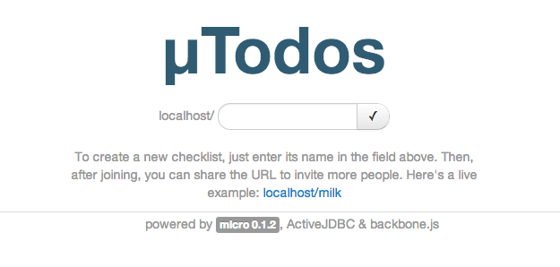
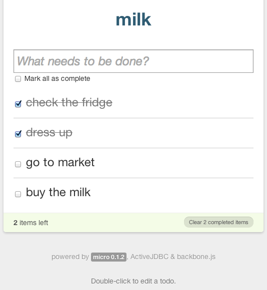
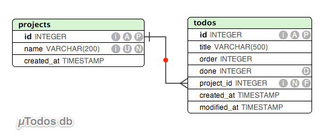

## A micro todo web application

A simple implementation of [Backbone's famous Todo list](http://backbonejs.org/docs/todos.html) using the [(µ)Micro](http://micro.simplegames.ca) framework, [Twitter Bootstrap](http://twitter.github.io/bootstrap/index.html) and [ActiveJDBC](https://code.google.com/p/activejdbc/) for data persistence. 

This is the home page of the app you can see after starting the Micro server. 

And this is the main checklist management page:  

### The demo
Apart from adding the database persistence layer, the `µTodos` web application extends the [Backbone Todo](http://backbonejs.org/docs/todos.html) demo with some extra functionality, such as: the ability to create and manage multiple ad-hoc checklists, each of them having their own set of Todo items that can be edited, completed and/or deleted. A checklist will be created only if there are Todo items associated with it. Here is the database schema used by this application:

  

While there are lots of functions missing, such as: user authentication and authorization, items reordering, alarms and notifications, etc., this simple web application can be used as a shared public checklist for simple tasks and can be easily hosted on any computer, at work or at home. You are more than welcome to improve it and to send us pull requests containing the improvements.

### Prerequisites

 - check if the (µ)Micro framework is installed properly; see the [docs](http://micro-docs.simplegames.ca/), for more details.
 - quickly check if Micro was built properly and if it is in your path:
    `$ micro -v`; you should see something like this: `Micro 0.1.2`

### Build
To build the application, go to the application's own folder and run:

    $ cd WEB-INF
    $ ant

Please to the steps above every time you're updating the models or the controllers code. Having clean binaries, will be important for the test units provided with this demo.

### Testing
Another reason for writing this demo, was to improve Micro' own support for unit testing. You can see a good set of test units in the `WEB-INF/test` folder. To run the unit tests simply go to `WEB-INF/test` and run: `ant`. While perfectly usable for testing the web applications built with Micro, the future versions of Micro will improve a lot the support for unit testing, stay tuned!

### Usage
To start this web application, go to the app folder and run:

    $ ./run.sh

You can access the demo by pointing your browser to: `http://localhost:8080` or `http://0.0.0.0:8080`

### To stop the app

Simply press `CTRL-C` in the console where the application was started.

Happy task completion!  
`:)`
